# TechHub Infrastructure Project
### My first end-to-end Linux + Networking build

---

## About This Project

This is my first proper hands-on infrastructure project, and I wanted to document it the way I actually built it — including the mistakes, since honestly I learned more from fixing those than from the parts that worked first try.

The scenario: I'm simulating the IT setup for a small startup called **TechHub**, which has three teams — Management/Admin, Engineering/Dev, and a Server Farm. The goal was to design the network, stand up a Linux server, run real services on it (DNS, web hosting, file sharing), and then lock everything down with automation and security hardening.

Everything here runs locally — a simulated network in Cisco Packet Tracer, and a real Ubuntu Server VM in VirtualBox on my Windows laptop.

---

## Tools I Used

| Tool | What I Used It For |
|---|---|
| **Cisco Packet Tracer** | Simulating the network — VLANs, router, switch |
| **Oracle VirtualBox** | Running my Ubuntu Server VM |
| **Ubuntu Desktop/Server** | The OS for my "server" |
| **BIND9** | Local DNS server for `techhub.local` |
| **Apache2** | Hosting two internal websites |
| **Samba** | Cross-platform file sharing (Linux ↔ Windows) |
| **UFW** | Firewall |
| **Bash + Cron** | Automated backups + health monitoring |

---

## Project Structure

```
Phase 1 → Network Design & Subnetting (Packet Tracer)
Phase 2 → Linux Server Setup & User Permissions
Phase 3 → Core Services: DNS, Web Server, File Sharing
Phase 4 → Automation, Monitoring & Security Hardening
```

I actually built Phases 2-4 first (since I had my VM ready), and did Phase 1 (Packet Tracer) last. I'm documenting it in logical order below, but just a heads up that's the real order things happened in.

---

## Phase 1: Network Design & Subnetting

### What this is

Before touching any server, I designed the network itself. TechHub has three zones, and I didn't want them all on one flat network — that's bad for both security and organization. I used **VLSM (Variable Length Subnet Masking)** to split my base network `192.168.10.0/24` into three right-sized chunks.

### My Subnet Plan

| VLAN | Department | Subnet | Range | Mask | Max Hosts |
|---|---|---|---|---|---|
| VLAN 10 | Management & Admin | 192.168.10.0/27 | .0 – .31 | 255.255.255.224 | 30 |
| VLAN 100 | Server Farm (isolated) | 192.168.10.32/28 | .32 – .47 | 255.255.255.240 | 14 |
| VLAN 20 | Engineering & Dev | 192.168.10.64/26 | .64 – .127 | 255.255.255.192 | 62 |

Management gets a /27 since it doesn't need many IPs, the Server Farm gets a tight /28 since it should only ever host a handful of servers, and Dev/Engineering gets the biggest block (/26) since that's where most devices will live.

### Building the Topology

In Packet Tracer I placed:
- 1× Router (Cisco 1941 — Packet Tracer gave me this one, even though my original plan said 4321. Worked out fine, just different interface naming, more on that below)
- 1× Switch (Cisco 2960)
- 3× PCs (one per department)

Cabling: each PC → Switch (Copper Straight-Through), and Switch → Router using the switch's `GigabitEthernet0/1` to the router's `GigabitEthernet0/0` port.

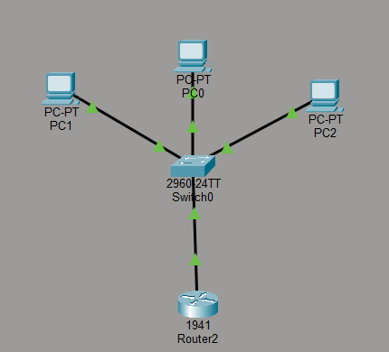

> **Lesson #1:** My original plan assumed a 4321 router, which uses `GigabitEthernet0/0/0` style naming (with three numbers, for modular routers). Packet Tracer gave me a 1941 instead, which only has `GigabitEthernet0/0` and `GigabitEthernet0/1` (two numbers). Took me a minute to realize the commands needed adjusting — not a big deal once I figured it out, but a good reminder to always check `show ip interface brief` to see what your device actually calls its ports instead of assuming.

### VLAN Configuration on the Switch

```bash
enable
configure terminal

vlan 10
 name Management_Admin
exit

vlan 20
 name Eng_Dev
exit

vlan 100
 name Server_Farm
exit
```

> **Lesson #2:** I actually mixed up VLAN 20 and VLAN 100 the first time — created VLAN 100 and named it "Eng_dev" by mistake. Fixed it by just re-entering `vlan 100` and giving it the correct name (`Server_Farm`) — turns out you don't need to delete anything, just re-running `vlan <id>` + `name <newname>` overwrites it.

Then I assigned each PC's port to its VLAN:

```bash
interface fastEthernet0/1
 switchport mode access
 switchport access vlan 10
exit

interface fastEthernet0/2
 switchport mode access
 switchport access vlan 20
exit

interface fastEthernet0/3
 switchport mode access
 switchport access vlan 100
exit
```

And set the link to the router as a trunk port (carries all VLANs):

```bash
interface gigabitEthernet0/1
 switchport mode trunk
exit
```

`show vlan brief` confirmed: `Fa0/1` under VLAN 10, `Fa0/2` under VLAN 20, `Fa0/3` under VLAN 100. ✅

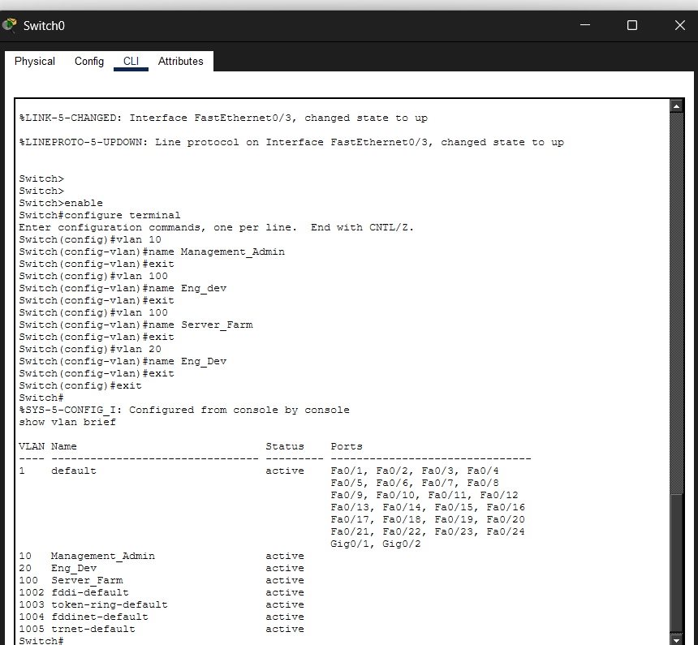

### Inter-VLAN Routing on the Router (Router-on-a-Stick)

VLANs can't talk to each other by default — they're isolated at Layer 2. To let them communicate (in a controlled way), I created **sub-interfaces** on the router, one per VLAN, all riding on the same physical link to the switch.

```bash
enable
configure terminal

interface gigabitEthernet0/0
 no shutdown
exit

interface gigabitEthernet0/0.10
 encapsulation dot1Q 10
 ip address 192.168.10.1 255.255.255.224
exit

interface gigabitEthernet0/0.20
 encapsulation dot1Q 20
 ip address 192.168.10.65 255.255.255.192
exit

interface gigabitEthernet0/0.100
 encapsulation dot1Q 100
 ip address 192.168.10.33 255.255.255.240
exit
```

`show ip interface brief` confirmed all three sub-interfaces `up/up` with the right IPs.

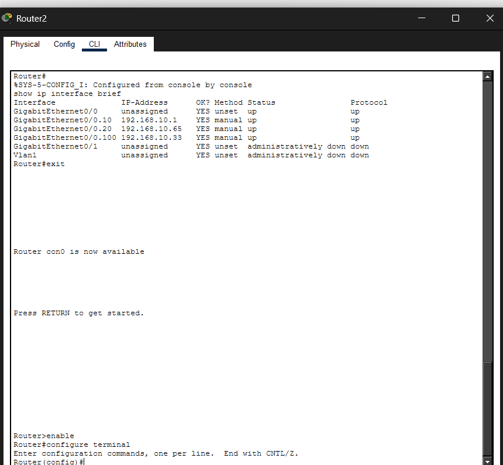

### Assigning IPs to PCs

| PC | VLAN | IP Address | Subnet Mask | Default Gateway |
|---|---|---|---|---|
| PC0 | 10 (Management) | 192.168.10.2 | 255.255.255.224 | 192.168.10.1 |
| PC1 | 20 (Eng/Dev) | 192.168.10.66 | 255.255.255.192 | 192.168.10.65 |
| PC2 | 100 (Server Farm) | 192.168.10.34 | 255.255.255.240 | 192.168.10.33 |

### Testing — Inter-VLAN Ping

From PC0's command prompt:

```
ping 192.168.10.1    → 4/4 success (TTL=255, router itself)
ping 192.168.10.65   → 4/4 success (TTL=255, router's other sub-interface)
ping 192.168.10.34   → 3/4 success (TTL=127, PC2 — across VLANs!)
```

That `TTL=127` on the last one is the proof — PC0 (VLAN 10) reached PC2 (VLAN 100) **through the router**. Windows PCs start at TTL 128, and every hop through a router subtracts 1. So TTL=127 = exactly one router hop. Inter-VLAN routing works! 🎉 (First packet timing out is normal — that's just ARP figuring out MAC addresses for the first time.)

### Locking Down the Server Farm with an ACL

I didn't want the Management or Dev VLANs to have free rein over the Server Farm. So I added an **ACL (Access Control List)** — basically a set of allow/deny rules the router checks for every packet, top to bottom, first match wins.

```bash
access-list 101 permit tcp 192.168.10.0 0.0.0.31 192.168.10.32 0.0.0.15 eq www
access-list 101 deny ip any 192.168.10.32 0.0.0.15

interface gigabitEthernet0/0.100
 ip access-group 101 out
exit
```

In plain English: "Only allow HTTP (port 80) traffic from the Management subnet into the Server Farm. Block literally everything else trying to get in."

**Testing it:** After applying the ACL, I ran `ping 192.168.10.34` from PC0 again — and this time it **failed** (request timed out). At first I was confused since it worked fine a minute ago! Then I realized — that's actually **correct**. Ping uses ICMP, not HTTP, so rule #2 (`deny ip any ...`) catches it and drops it. The ACL is doing exactly its job — only HTTP gets through, everything else (including ping) is blocked. Kind of a cool "aha" moment once I understood why it "broke."

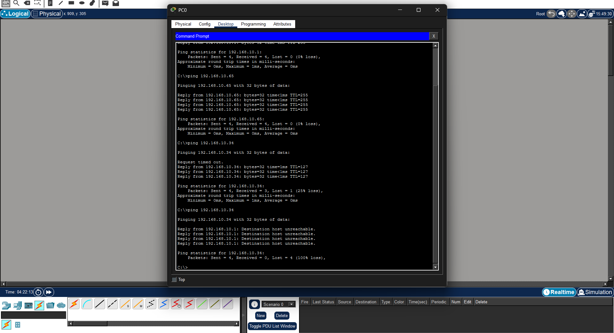

---

## Phase 2: Linux Server Setup & User Permissions

### Setting up the VM

I used VirtualBox with:
- Ubuntu Desktop (ended up using the Desktop version, not Server — gave me gedit and a GUI which made editing config files way easier)
- 6 CPUs, 6GB RAM
- **Bridged Adapter** network mode — this was important, it gives the VM its own real IP on my home network (`192.168.1.13` in my case) instead of hiding behind NAT

### Creating Users and Groups

TechHub needs an admin and two devs:

```bash
sudo groupadd sysadmin
sudo groupadd devteam

sudo useradd -m -g sysadmin -s /bin/bash admin_A
sudo useradd -m -g devteam -s /bin/bash dev_1
sudo useradd -m -g devteam -s /bin/bash dev_2

sudo passwd admin_A
sudo passwd dev_1
sudo passwd dev_2
```

> **Lesson #3:** After creating the groups, I ran `cat /etc/group | grep -E "sysadmin|devteam"` expecting to see the usernames listed — but they weren't there. Turns out `/etc/group` only lists *secondary* group memberships in that member list; since I assigned these as each user's *primary* group (with `-g`), they don't show up there even though everything's correctly set up. To actually verify, `id admin_A` is the right command — it shows `gid=1001(sysadmin)` clearly.

> **Lesson #4 (bigger one):** Way later, when I tried to use `admin_A` for sysadmin tasks, every `sudo` command gave me this hilarious error: `sudo: I'm sorry admin_A. I'm afraid I can't do that` (a HAL 9000 reference — apparently `sudo` has a fun "insults" mode). The actual problem: I never added `admin_A` to the `sudo` group! Fixed with:
> ```bash
> sudo usermod -aG sudo admin_A
> ```
> Good reminder that creating a user doesn't automatically give them admin rights — that's a separate, deliberate step.

### Shared Folder for the Dev Team

```bash
sudo mkdir -p /srv/shares/project_data
sudo chown :devteam /srv/shares/project_data
sudo chmod 770 /srv/shares/project_data
sudo chmod +t /srv/shares/project_data
```

- `770` → owner and group get full access, everyone else gets nothing
- `+t` (the **sticky bit**) → this is the interesting one. Even though both `dev_1` and `dev_2` can read/write in this folder, the sticky bit means **only the file's owner (or root) can delete or rename it**. Without this, `dev_1` could delete `dev_2`'s files just by having write access to the shared folder — sticky bit closes that gap.

`ls -ld /srv/shares/project_data` should show `drwxrwx--T` — the capital `T` at the end confirms the sticky bit is active (capital because "others" have no execute permission anyway).

---

## Phase 3: Core Services

### 1. DNS with BIND9

The idea: instead of typing IP addresses, devices on the network can use `www.techhub.local` like a real internal domain.

```bash
sudo apt install bind9 bind9utils bind9-doc -y
```

`/etc/bind/named.conf.local`:
```
zone "techhub.local" {
    type master;
    file "/etc/bind/zones/db.techhub.local";
};
```

> **Lesson #5:** This file actually came pre-populated with a zone block — but for `mycorp.local`, and it was also missing a semicolon at the end of the `file` line (syntax error waiting to happen). Had to fix both: rename the zone to `techhub.local`, and add the missing `;`.

Then the actual zone file (`/etc/bind/zones/db.techhub.local`):

```
$TTL    604800
@       IN      SOA     techhub.local. root.techhub.local. (
                              1         ; Serial
                         604800         ; Refresh
                          86400         ; Retry
                        2419200         ; Expire
                         604800 )       ; Negative Cache TTL
;
@       IN      NS      techhub.local.
@       IN      A       192.168.10.34
www     IN      A       192.168.10.34
internal IN     A       192.168.10.34
```

> **Lesson #6:** I expected a template file (`db.local`) to exist to copy from, but `ls /etc/bind/` showed it wasn't there on my system. Ended up just writing the zone file from scratch — turns out it's not that long anyway, and now I actually understand every line instead of just copying a template blindly.

`sudo systemctl restart bind9` → status showed **active (running)**. Testing with `dig @127.0.0.1 www.techhub.local` returned the right IP. ✅

> **Lesson #7 (the big one):** Even though `dig @127.0.0.1` worked, plain `curl http://www.techhub.local` failed with "could not resolve host." Took some digging (pun intended) — turns out **Ubuntu's `systemd-resolved` treats `.local` domains specially** and routes them to mDNS (used for things like network printer discovery), completely ignoring whatever DNS server is configured in `resolv.conf`. The fix was to create a **routing domain**:
> ```bash
> sudo resolvectl dns enp0s3 127.0.0.1
> sudo resolvectl domain enp0s3 "~techhub.local"
> sudo resolvectl flush-caches
> ```
> The `~techhub.local` syntax tells systemd-resolved "specifically route anything ending in `.techhub.local` to this DNS server, overriding the normal `.local` mDNS behavior." This was honestly the trickiest bug of the whole project — a real "it's not the tool, it's how the OS routes the request" lesson.
>
> 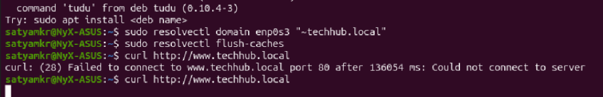

### 2. Apache2 with Virtual Hosts

Two websites, one server, one IP — Apache picks which site to serve based on the requested hostname.

```bash
sudo apt install apache2 -y
sudo mkdir -p /var/www/techhub/public_html
sudo mkdir -p /var/www/internal/public_html
```

`/etc/apache2/sites-available/techhub.conf`:
```apache
<VirtualHost *:80>
    ServerName www.techhub.local
    DocumentRoot /var/www/techhub/public_html
</VirtualHost>

<VirtualHost *:80>
    ServerName internal.techhub.local
    DocumentRoot /var/www/internal/public_html
</VirtualHost>
```

```bash
sudo a2ensite techhub.conf
sudo a2dissite 000-default.conf
sudo systemctl restart apache2
```

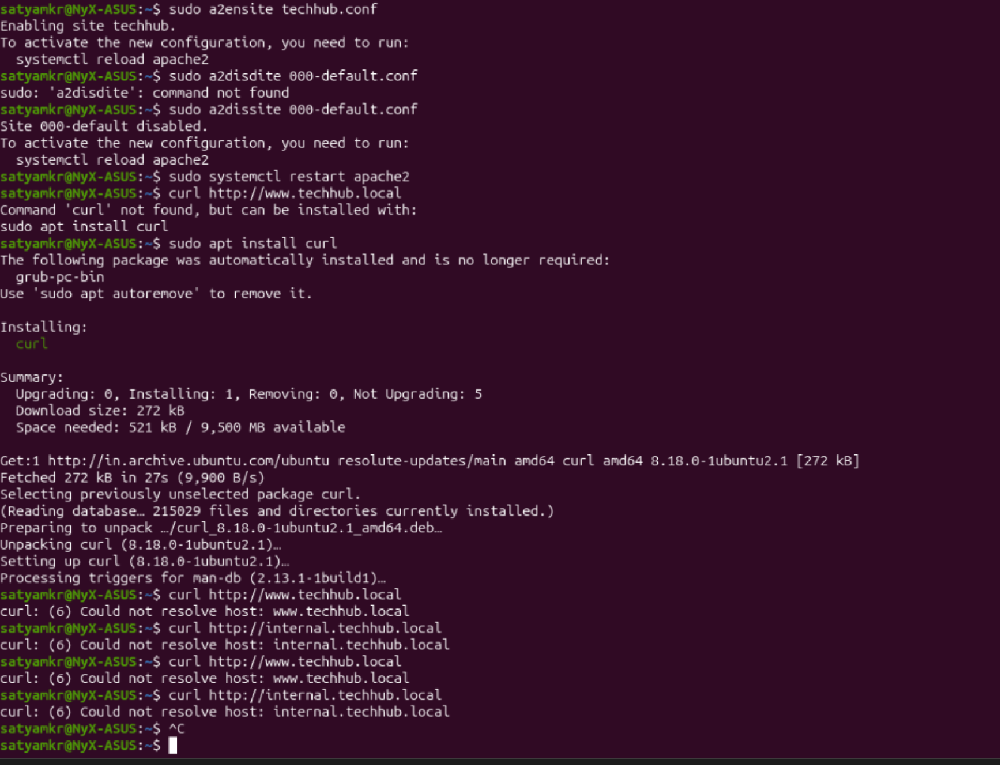

> **Lesson #8:** After fixing the DNS routing issue above, `curl` still failed at first — this time with `(28) Failed to connect ... Could not connect to server`. The DNS *resolution* worked, but the IP it resolved to (`192.168.10.34`, from my original plan) **wasn't actually my VM's real IP** (which was `192.168.1.13`, assigned by my home router via the Bridged Adapter). Updated the zone file's `A` records to point to my actual VM IP, restarted BIND9, and `curl` finally returned my test pages correctly.

### 3. Samba (File Sharing with Windows)

```bash
sudo apt install samba -y
```

`/etc/samba/smb.conf` (added at the bottom):
```ini
[ProjectDataShare]
   comment = TechHub Dev Team Shared Storage
   path = /srv/shares/project_data
   browsable = yes
   read only = no
   guest ok = no
   valid users = @devteam
```

```bash
sudo smbpasswd -a dev_1
sudo systemctl restart smbd
```

Connected from Windows File Explorer via `\\192.168.1.13\ProjectDataShare`, logged in as `dev_1`, created a test file. Went back to the VM and `sudo ls -l /srv/shares/project_data` — there it was, owned by `dev_1`, group `devteam`. Cross-platform file sharing, working end to end. ✅

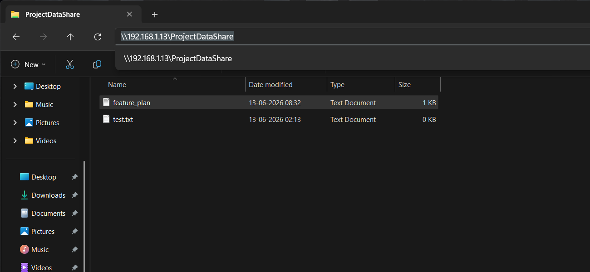

---

## Phase 4: Automation, Monitoring & Security Hardening

### 1. SSH Hardening

In `/etc/ssh/sshd_config`:
```
Port 2222
PermitRootLogin no
MaxAuthTries 3
```

- **Port 2222** — moves SSH off the default port 22, so the constant background noise of bots scanning port 22 doesn't even reach it
- **PermitRootLogin no** — nobody logs in directly as root; must use a normal account + `sudo`
- **MaxAuthTries 3** — drops the connection after 3 bad password attempts

I deliberately left `PasswordAuthentication` alone (commented out, defaults to `yes`) — switching to key-only auth would be a great next step, but requires setting up SSH keys first, and I didn't want to risk locking myself out before getting that working.

```bash
sudo systemctl restart ssh
```

### 2. Automated Backup Script

`/usr/local/bin/backup_system.sh`:
```bash
#!/bin/bash
# TechHub Nightly Backup Script

BACKUP_DIR="/var/backups/enterprise"
TARGET_SRC="/var/www"
TIMESTAMP=$(date +%Y%m%d_%H%M%S)
ARCHIVE_NAME="web_backup_$TIMESTAMP.tar.gz"
LOG_FILE="/var/log/backup_audit.log"

mkdir -p "$BACKUP_DIR"

echo "[$(date)] Backup started." >> "$LOG_FILE"

tar -czf "$BACKUP_DIR/$ARCHIVE_NAME" "$TARGET_SRC"

HASH_VAL=$(sha256sum "$BACKUP_DIR/$ARCHIVE_NAME" | awk '{print $1}')
echo "[$(date)] Archive: $ARCHIVE_NAME | SHA256: $HASH_VAL" >> "$LOG_FILE"

echo "[$(date)] Backup completed successfully." >> "$LOG_FILE"
```

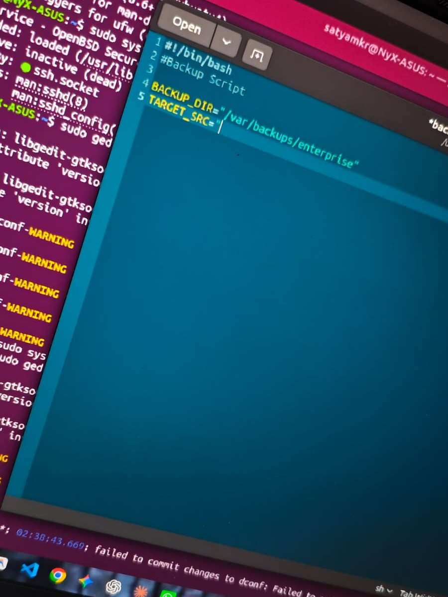

Compresses `/var/www` into a timestamped archive, then generates a **SHA256 hash** as a fingerprint — if anyone ever tampers with the backup, the hash won't match anymore and I'd know.

```bash
sudo chmod +x /usr/local/bin/backup_system.sh
sudo /usr/local/bin/backup_system.sh
```

Ran it manually, checked `/var/log/backup_audit.log` — all three log lines were there with a real SHA256 hash. ✅

### 3. Health Check Script

`/usr/local/bin/health_check.sh`:
```bash
#!/bin/bash
# TechHub Service Health Monitor

LOG_FILE="/var/log/service_health.log"
TIMESTAMP=$(date "+%Y-%m-%d %H:%M:%S")

SERVICES=("apache2" "bind9" "smbd")

for service in "${SERVICES[@]}"; do
    if systemctl is-active --quiet "$service"; then
        echo "[$TIMESTAMP] OK: $service is running." >> "$LOG_FILE"
    else
        echo "[$TIMESTAMP] WARNING: $service is NOT WORKING!" >> "$LOG_FILE"
    fi
done
```

### 4. Cron Automation

```bash
sudo crontab -e
```

```
0 2 * * * /usr/local/bin/backup_system.sh
*/5 * * * * /usr/local/bin/health_check.sh
```

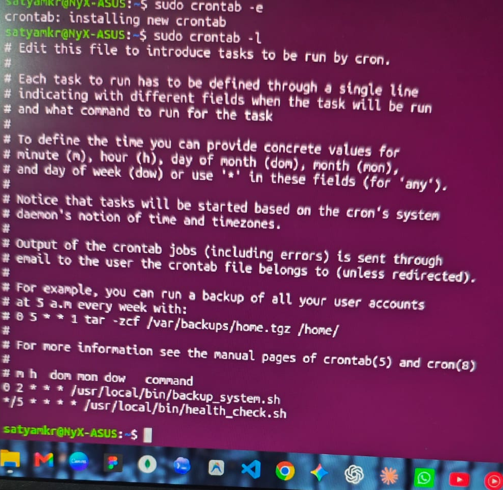

- Backup runs every night at 2 AM
- Health check runs every 5 minutes

### 5. Firewall (UFW)

```bash
sudo ufw default deny incoming
sudo ufw default allow outgoing

sudo ufw allow 2222/tcp comment 'SSH (hardened port)'
sudo ufw allow 80/tcp comment 'Apache HTTP'
sudo ufw allow 53 comment 'BIND9 DNS'
sudo ufw allow 139/tcp comment 'Samba NetBIOS'
sudo ufw allow 445/tcp comment 'Samba SMB'

sudo ufw enable
```

`sudo ufw status verbose` confirmed: default deny incoming / allow outgoing, with all 5 services explicitly allowed (both IPv4 and IPv6). Everything else is blocked by default now.

---

## Results & Verification — "A Day in the Life of TechHub"

To prove this all actually works together (not just individually), I ran through a few real scenarios:

### `dev_1` and `dev_2` collaborating

```bash
su dev_1
echo "Feature plan: login page redesign" > /srv/shares/project_data/feature_plan.txt
exit

su dev_2
ls -l /srv/shares/project_data        # dev_1's file is visible
cat /srv/shares/project_data/feature_plan.txt   # dev_2 can read it
rm /srv/shares/project_data/feature_plan.txt    # FAILS — sticky bit in action
```

**dev_1 creating the feature plan:**
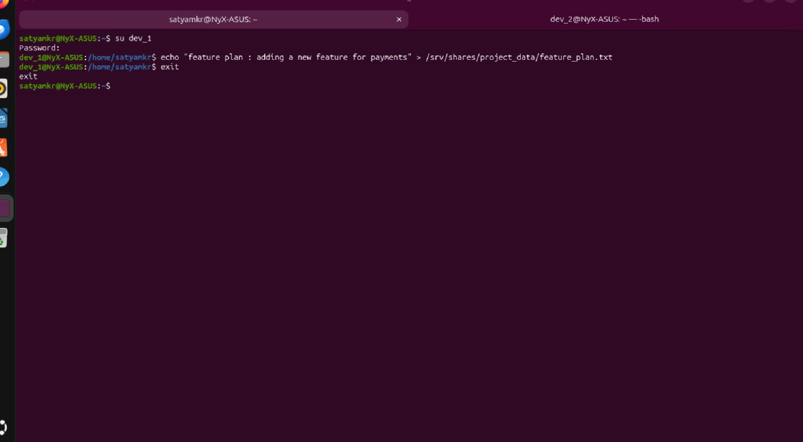

**dev_2 unable to delete dev_1's file (sticky bit active):**
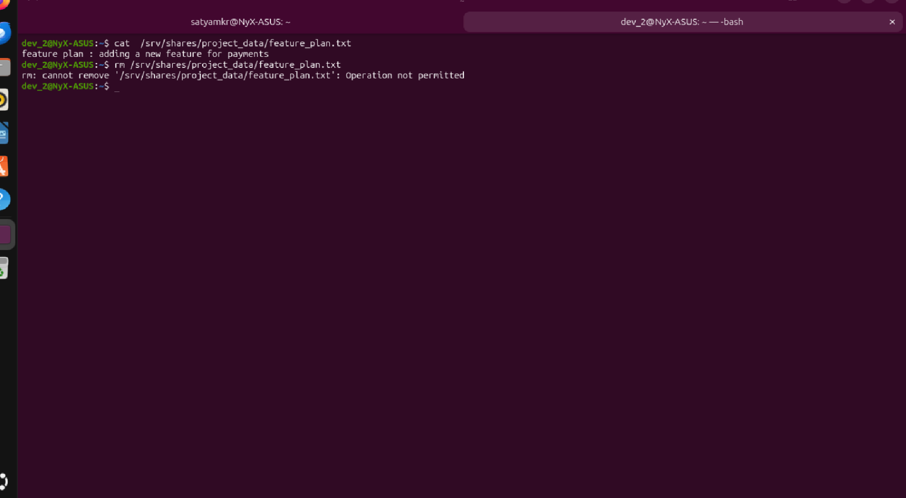

`dev_2` can read `dev_1`'s file (group permissions working as intended) but **cannot delete it** — "Operation not permitted," courtesy of the sticky bit from Phase 2.

### `admin_A` doing routine checks

```bash
sudo systemctl status apache2 bind9 smbd
sudo tail -5 /var/log/service_health.log
sudo tail -5 /var/log/backup_audit.log
sudo ufw status verbose
```

**Admin user status check and HAL 9000 error (Lesson #4):**
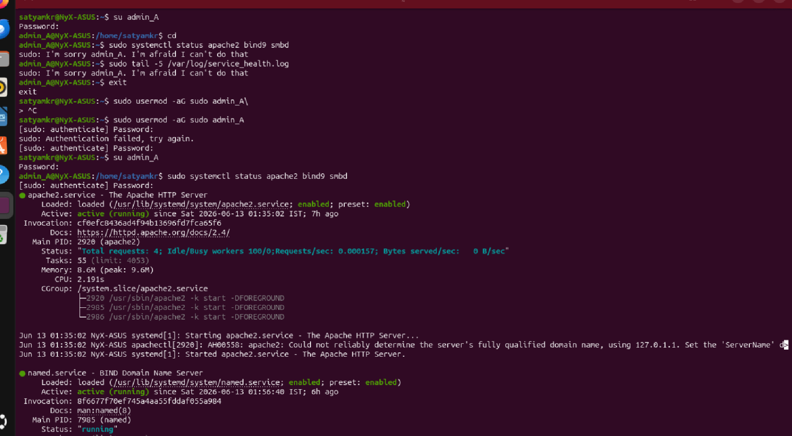

**Service statuses (scrolled down):**
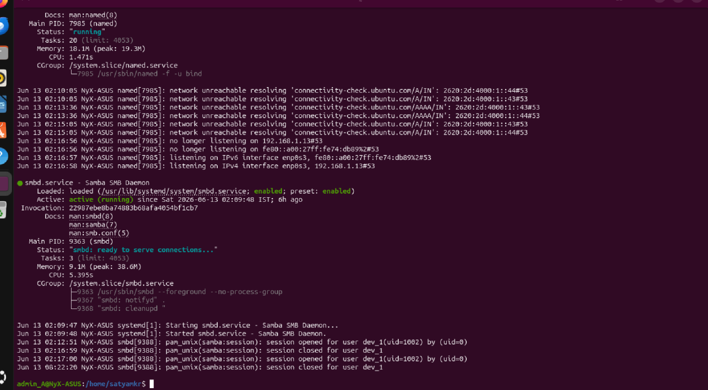

**Checking logs tail and firewall status:**
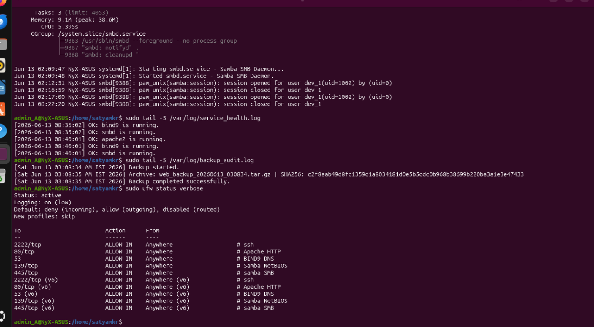

All services active, health log showing "OK" for all three every 5 minutes, backup log showing a successful nightly run with hash, firewall locked down to only the 5 needed ports.

### Network behaving as designed

- `ping` from PC0 → router sub-interfaces → success, proving each VLAN's gateway is reachable
- `ping` from PC0 → PC2 (cross-VLAN) → success **before** the ACL, with `TTL=127` proving it routed through the router
- `ping` from PC0 → PC2 → **fails after the ACL**, because the ACL only permits HTTP, not ICMP — exactly as designed

---

## What I Learned

Honestly, more than I expected for a "beginner" project. A few big takeaways:

- VLANs and subnetting aren't just theory. You can watch traffic get blocked or routed in real time, and it actually clicks differently than reading about it.
- Writing scripts is not that different from coding, but they have different syntax and elements than Python.
- `.local` domains have special handling in modern Linux (mDNS) — something I'd never have known without hitting it head-on.
- Permissions (sticky bit especially) aren't just abstract concepts — they solve real "who can mess with whose files" problems.
- Security is layered — SSH hardening + firewall + ACLs + file permissions all stack together, no single setting does it all.

## What I'd Improve Next

- Set up SSH key-based authentication (and properly disable password auth once keys work)
- Add HTTPS to Apache with a self-signed cert
- Build a second VM as a "client" to test DNS/Samba from a completely separate machine
- Containerize the Apache sites with Docker
- Add `fail2ban` to auto-ban repeated failed SSH attempts
- Turn the health check log into a live terminal dashboard
- Try to understand disk security/phases more, as it could be useful to keep track of it and use it as a security measure without users (devs or attackers) knowing.

