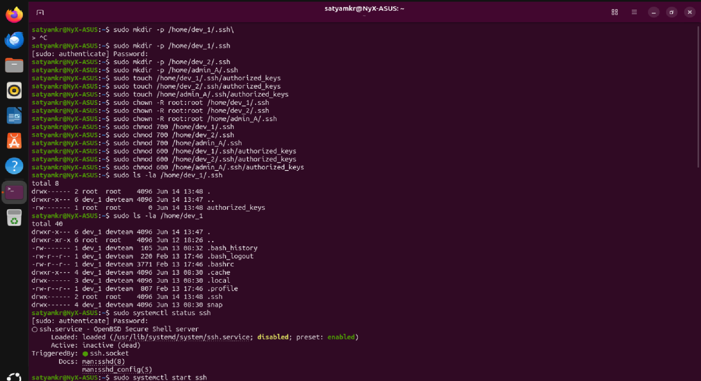
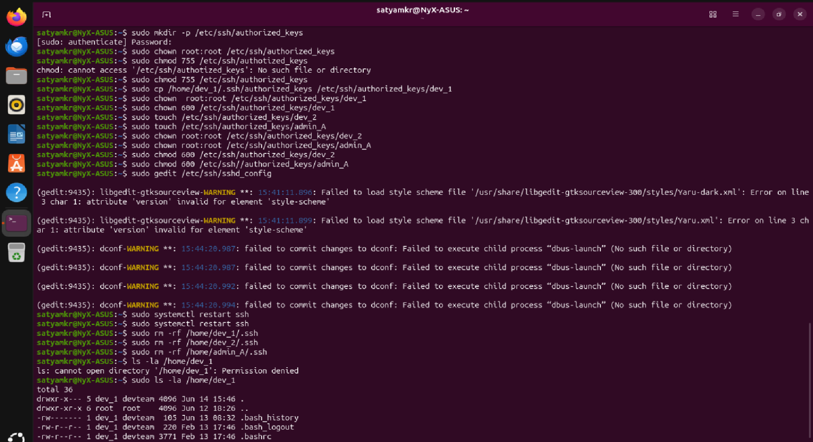
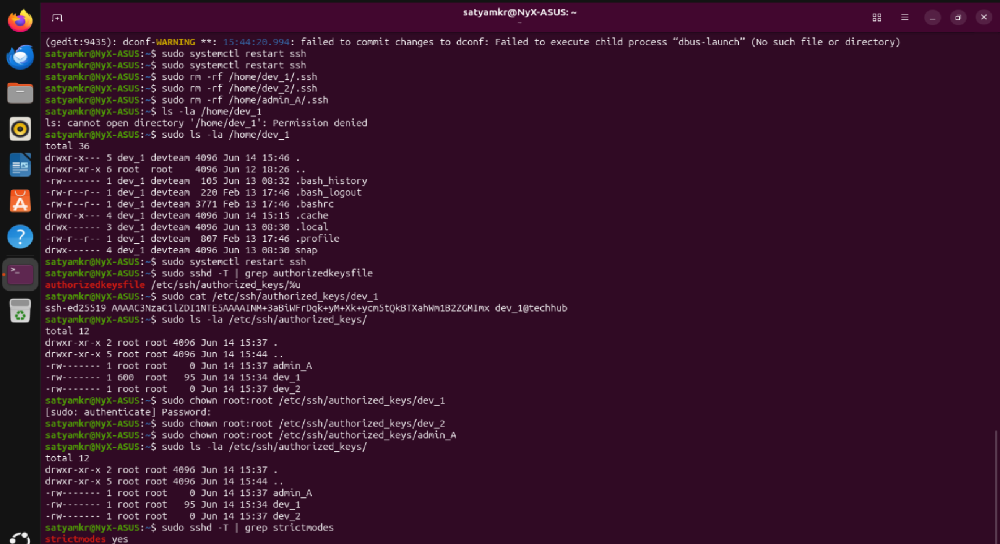
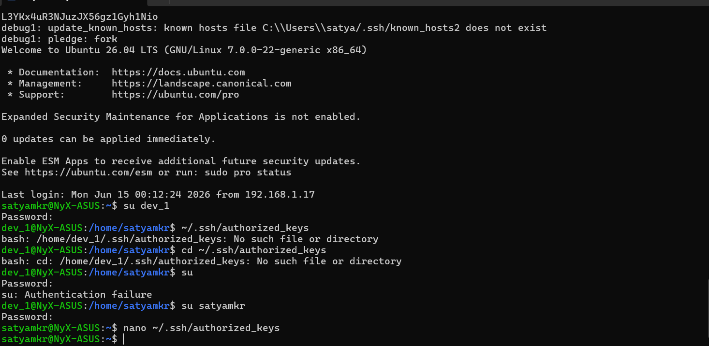
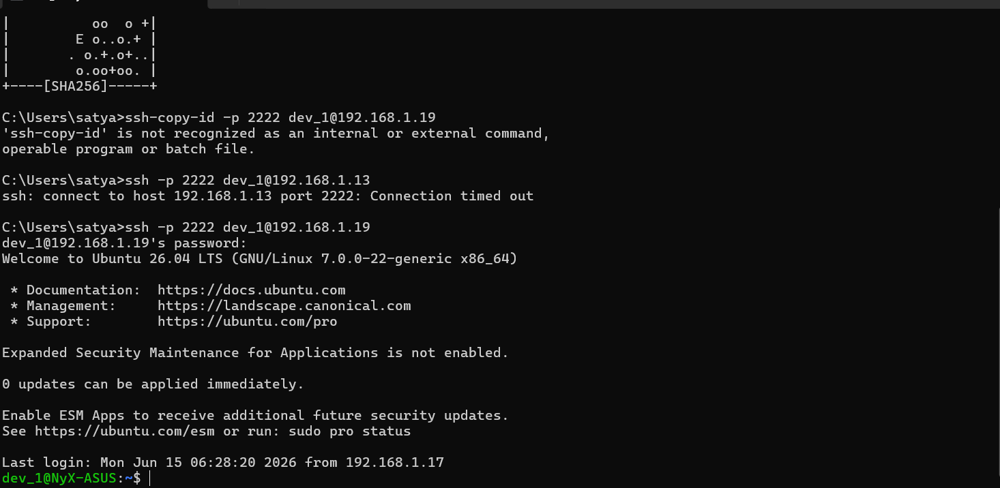
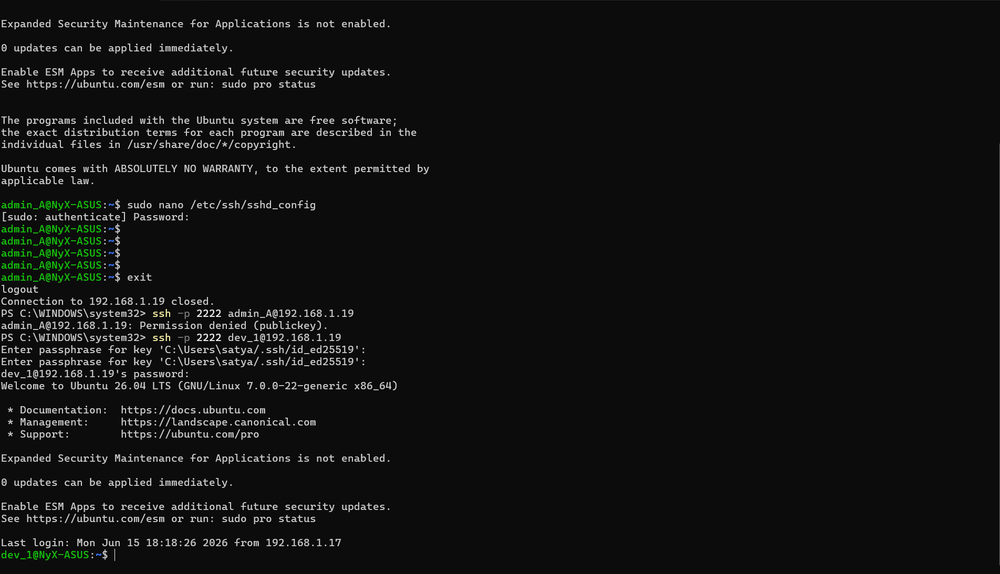
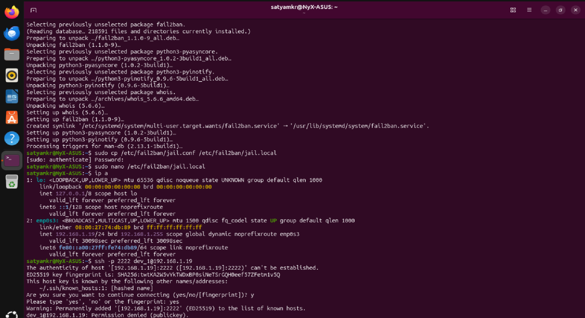
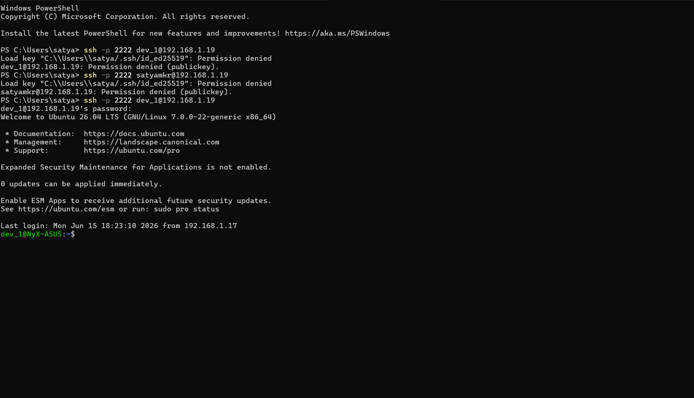

# TechHub Infrastructure: SSH Security & 2FA Upgrade

This document logs the complete evolutionary process of hardening SSH security on the TechHub Ubuntu Server—detailing both our initial testing failures, key learnings, and the final successful deployment of a strict **Two-Factor Authentication (2FA)** standard and automated intrusion prevention.

---

## The Vision: Invisible Device Verification & 2FA

Passwords alone represent a single point of compromise. If a developer's remote access password is leaked, the entire server is vulnerable. The objective was to implement a verification mechanism that validates *both* the device connecting (using cryptographic keys) and the user's identity (using their password), working together as a multi-factor authentication scheme.

Initially, simple MAC address filtering was considered, but quickly discarded. MAC addresses are trivial to spoof, do not traverse routers on remote networks (rendering them useless for off-site developers), and modern devices randomize MAC addresses. Instead, **SSH Key-Based Authentication** paired with user passwords was selected as the correct security control.

---

## Part 1: The Initial Attempt & Centralized Key Management (Failure Log)

Before deploying to the active environment, we attempted a customized configuration where user keys were centralized and locked down under root ownership, rather than sitting in the user's home directories. This section documents that attempt, the bugs encountered, and why it was eventually rolled back.

### 1. Generating the Key Pair (Windows client)
We generated an `ed25519` key pair (selected for its small size and superior cryptographic strength compared to RSA):
```powershell
ssh-keygen -t ed25519 -C "dev_1@techhub"
```
* **Lesson Learned**: The command initially failed because the directory `C:\Users\<Username>\.ssh\` did not exist on Windows. Creating the directory manually resolved the issue.
* The private key was encrypted with a passphrase to protect it in case the developer's laptop was stolen.

### 2. Standard Server-Side setup & Directory Ownership Bug
Initially, we created the directories and keys for users under their respective home folders:
```bash
sudo mkdir -p /home/dev_1/.ssh
sudo touch /home/dev_1/.ssh/authorized_keys
```

To prevent developers from modifying their own public keys, we assigned root ownership to these directories:
```bash
sudo chown -R root:root /home/dev_1/.ssh
sudo chmod 700 /home/dev_1/.ssh
sudo chmod 600 /home/dev_1/.ssh/authorized_keys
```



* **Lesson Learned**: This was a critical mistake. SSH daemon security constraints require the connecting user (not `root`) to own their own `~/.ssh/` directory and `authorized_keys` file. When owned by root, the SSH daemon silently ignored the key and fell back to standard password prompt.

### 3. Transition to Centralized Key Storage
To enforce the restriction that developers could not edit their own authorized keys, we moved key files to a root-owned, centralized `/etc/` path:
```bash
sudo mkdir -p /etc/ssh/authorized_keys
sudo chmod 711 /etc/ssh/authorized_keys
```
> **Security Design**: Permissions were set to `711` (traverse only), which allowed the SSH daemon to query individual files inside the folder, but restricted standard users from listing (`ls`) or reading other files in `/etc/ssh/authorized_keys`.

We then directed the SSH daemon to check this directory by modifying `/etc/ssh/sshd_config`:
```text
AuthorizedKeysFile /etc/ssh/authorized_keys/%u
```
Here, `%u` is dynamically replaced by the connecting username (e.g., `/etc/ssh/authorized_keys/dev_1`).



### 4. Debugging the Centralized Setup
During testing, multiple issues emerged:
* **File Owner UID Mismatch**: We noticed a file owned by a numeric UID `600` instead of a username, caused by a previous `chown` typo. Running `sudo chown root:root` corrected the owner.
* **Permission Denied in `auth.log`**: Standard client connections still failed. Inspecting the authentication log (`sudo tail -f /var/log/auth.log`) revealed:
  ```text
  Could not open user 'dev_1' authorized keys ... Permission denied
  ```
  Even though the file was root-owned, the SSH daemon switches privileges to the connecting user before inspecting their keys. The strict `600` permissions (root read/write only) blocked the daemon from opening the key. Changing permissions to `644` (world-readable, root-writable) resolved this, allowing the daemon to read the key while keeping it write-protected from the user.



* **Loopback Connection Test**: We verified that key auth worked locally by generating a test key on the server and connecting to localhost:
  ```bash
  ssh -p 2222 -i /tmp/test_key dev_1@127.0.0.1
  ```
  This worked immediately, proving the server-side centralized logic was correct.
* **Windows Client Failures**: Connecting from the Windows OpenSSH client to the server consistently failed. The client refused to load the private key, throwing `Load key: Permission denied`. We attempted NTFS Access Control List (ACL) adjustments using `icacls`, re-generating keys, and forcing `IdentitiesOnly=yes`, but the connection continued to fail.

### 5. Deciding to Roll Back
Due to the cross-platform friction of managing NTFS ACLs vs POSIX permissions for Windows-to-Linux connections and the risk of locking out developers from the main TechHub system, we rolled back the centralized key config to a stable, clean state:
```bash
# Clean up centralized folder
sudo rm -rf /etc/ssh/authorized_keys

# Revert sshd_config and restore default user home directory permissions
sudo chmod 750 /home/dev_1
sudo chmod 750 /home/dev_2
sudo chmod 750 /home/admin_A

# Restart ssh service
sudo systemctl restart ssh
```

---

## Part 2: The Successful Implementation (Strict 2FA & Fail2Ban)

Following the lessons learned from the initial failure, we adopted a standard user-home configuration, but layered it with strict **Two-Factor Authentication (2FA)** rules, automated brute-force protections, and secure Windows attributes.

### Phase 1: Key Generation (Client Side)
On the developer's Windows workstation, we generated a fresh, secure key pair:
```cmd
ssh-keygen -t ed25519 -C "dev_1_laptop"
```
The public key (`id_ed25519.pub`) was output so it could be manually installed on the server:
```cmd
type C:\Users\<Username>\.ssh\id_ed25519.pub
```

### Phase 2: Installing the Public Key (Server Side)
Logging onto the server as `dev_1`, we initialized their personal SSH folder with the correct, daemon-compliant permissions:
```bash
mkdir -p ~/.ssh
chmod 700 ~/.ssh
nano ~/.ssh/authorized_keys
```
After pasting the public key, the file was locked down:
```bash
chmod 600 ~/.ssh/authorized_keys
```



Windows does not natively support `ssh-copy-id` out of the box, so copying the key string and setting POSIX permissions manually on the server was the cleanest installation path.



### Phase 3: Enforcing 2FA on the Server
To turn the server into a strict multi-factor gatekeeper, we updated the daemon configuration to require **both** public key possession *and* password entry.

1. Opened the configuration as `admin_A`:
   ```bash
   sudo nano /etc/ssh/sshd_config
   ```
2. Ensured key and password authentication mechanisms were active:
   ```text
   PubkeyAuthentication yes
   PasswordAuthentication yes
   ```
3. Added the explicit 2FA requirement to the end of the config file:
   ```text
   AuthenticationMethods publickey,password
   ```
4. Restarted the SSH daemon:
   ```bash
   sudo systemctl restart ssh
   ```

Now, the daemon strictly demands both factors. If the client does not present the matching `id_ed25519` key first, the connection is closed immediately. If the key matches, the server then prompts for the user password. If an administrator (like `admin_A`) tries to log in from a device that hasn't had its key registered, they are blocked.



### Phase 4: Deploying Fail2Ban for Intrusion Prevention
To protect the server port (`2222`) from brute-force botnets, we installed `fail2ban` and integrated it with the UFW firewall.

```bash
sudo apt install fail2ban -y
sudo cp /etc/fail2ban/jail.conf /etc/fail2ban/jail.local
sudo nano /etc/fail2ban/jail.local
```

We enabled and configured the `[sshd]` jail:
```ini
[sshd]
enabled = true
port    = 2222
logpath = %(sshd_log)s
backend = %(sshd_backend)s
maxretry = 3
bantime = 3600
findtime = 600
```
* **Security Rule**: Any IP address that fails authentication 3 times within 10 minutes is automatically banned by the firewall for 1 hour (3600 seconds).

After applying the configuration, the service was restarted:
```bash
sudo systemctl restart fail2ban
sudo fail2ban-client status sshd
```



### Phase 5: Local Windows Key Protection
To safeguard the private key on the developer's Windows client without breaking OpenSSH access:
1. We removed the local passphrase for operational convenience, as the server now handles the password prompt factor:
   ```cmd
   ssh-keygen -p -f C:\Users\<Username>\.ssh\id_ed25519
   ```
2. Instead of using complex Windows NTFS Deny rules (which OpenSSH for Windows interprets as a broad permission denial and blocks), we locked the private key file from accidental deletion or modification using standard Windows attributes:
   ```cmd
   attrib +h +r C:\Users\<Username>\.ssh\id_ed25519
   ```



The `attrib +h +r` flags flag the private key as hidden and read-only, preventing manual accidents while keeping the file readable for the Windows OpenSSH client.
